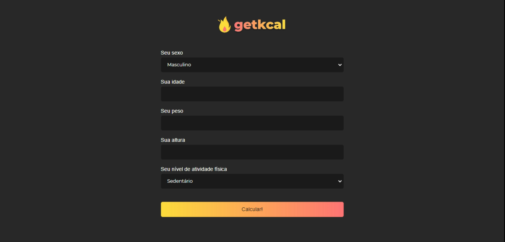

<h3 align="center">
    
</h3>

<h3 align="center">getkcal - JAVASCRIPT, HTML, CSS</h3>

<div align="center">
  <a href="https://www.linkedin.com/in/vinicius-piantoni-328339186">
    
  </a>
    
  <a href="https://github.com/ViniPiantoni/getkcal/blob/master/LICENSE">
    
  </a>
</div>

---

### Apresentação:

O <strong>getkcal</strong> é uma aplicação simples feita totalmente em JavaScript puro, que se constitui uma calculadora de calorias no qual há métodos para calculo de metabolismo basal, mantimento de peso, perder peso e ganhar peso.

<h3 align="center">
    
</h3>

---

### Tecnologias utilizadas
- JavaScript
- HTML
- CSS

---

 ### Instalação

 O projeto não necessita de nenhuma instalação.

 - Apenas clone o repositório:

 ```bash
$ git clone https://github.com/ViniPiantoni/getkcal.git
```

---

 ### Executando a aplicação

Para executá-la é muito simples, basta abrir o arquivo "index.html" em qualquer navegador.

---

### Contato

- [LinkedIn](https://www.linkedin.com/in/vinicius-piantoni/)
- vinicius4447@gmail.com

---

### Licença

Esse projeto está sob a licença MIT. Veja o arquivo [LICENSE](LICENSE) para mais detalhes.
